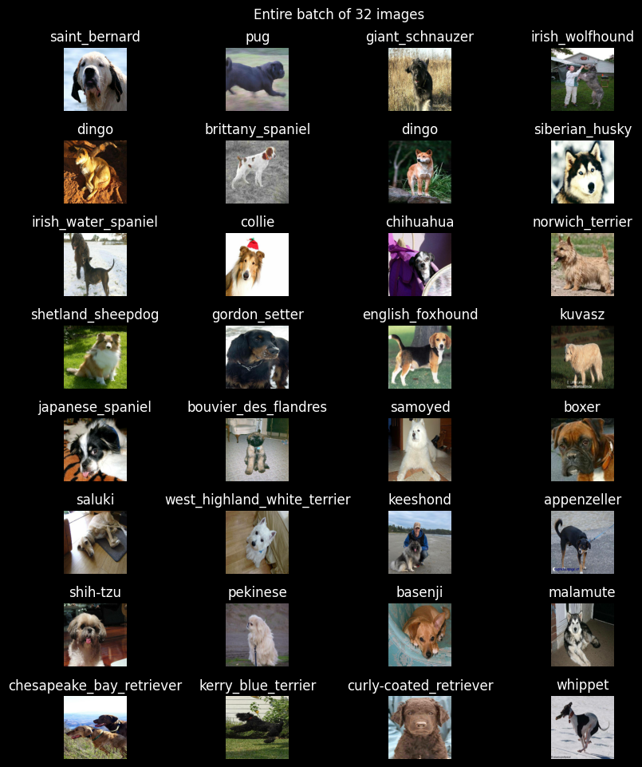
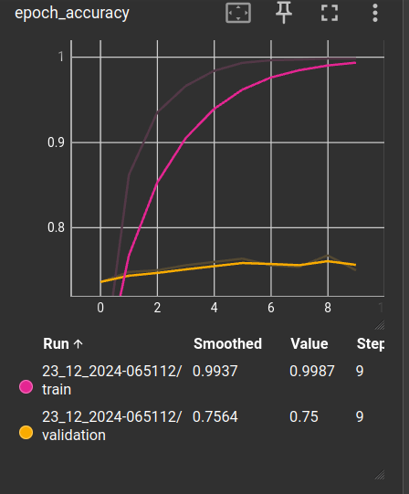

# Dog-Breed-Classification 🐕

A Deep Neural Network to **classify Dog images** among different Dog breeds using `TensorFlow & Keras`. This is a [Kaggle Project](https://www.kaggle.com/c/dog-breed-identification/overview) for classifying dog images into different Dog Breeds.

**Open Notebook 🔥**

 &nbsp; &nbsp;
 &nbsp; &nbsp;

## Approach for Model Building

**Transfer Learning** is implemented throughout the model building process, using [mobilenet_v3_130_224](https://www.kaggle.com/models/google/mobilenet-v3/TensorFlow2/large-075-224-classification/1) as our pre-trained model.

Keras (& TensorFlow) are primary libraries of interest here, with following parameters:

- [Adam Optimizer](https://machinelearningmastery.com/adam-optimization-algorithm-for-deep-learning/) as model optimizer.

- [Categorical Cross Entropy](https://keras.io/api/losses/probabilistic_losses/#categoricalcrossentropy-class) as our loss function.

- [Accuracy](https://keras.io/api/metrics/accuracy_metrics/) as performance metric.

---

**Using 10,000+ training images as Batches...**

---
## Submission to Kaggle

With only 1 submission, i got a **rank 808**, with a test prediction **loss of 0.89129**

---

## Training & Validation Performance (TensorBoard)

This are intermediate performance, data! It may be off-the-track!

  
  &nbsp;
  

 

> Final Model Performance **(after reloading best checkpoint model)** was :
 
- Validation loss: 0.8714
- Validation accuracy: **0.7676 (76.7%)**

## Final Predictions were like!

